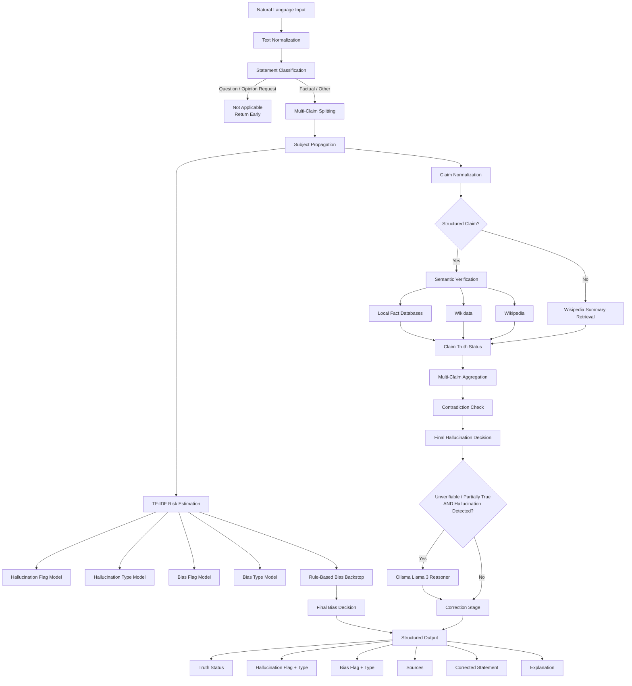
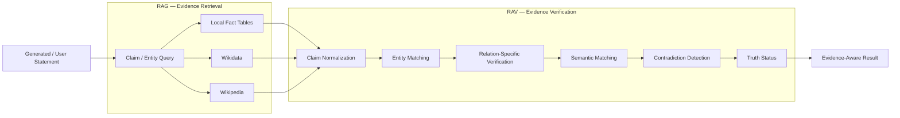
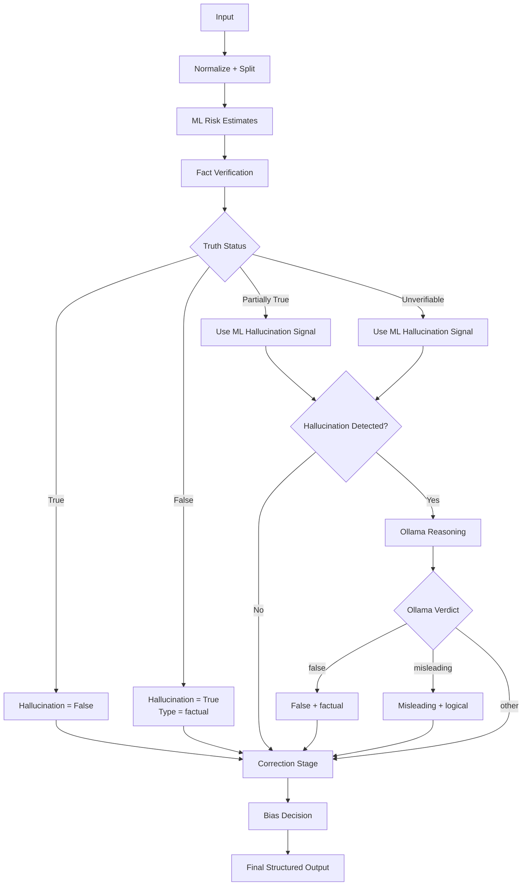

<div align="center">

# 🧠 AI Hallucination & Bias Detection System

### Retrieval-Augmented Generation (RAG) + Retrieval-Augmented Verification (RAV)

**A multi-stage NLP, knowledge-grounded verification pipeline for detecting hallucinations, identifying bias, validating factual claims, retrieving evidence, and producing evidence-aware corrections.**

<br>

[](https://www.python.org/)
[](https://scikit-learn.org/)
[](https://www.wikidata.org/)
[](https://www.wikipedia.org/)
[](https://ollama.com/)

<br>

**DSC Hackathon Project · January 2026**

[Repository](https://github.com/Rishi-Sampat/DSC_Hackathon_Project)

</div>

---

## 📌 Table of Contents

- [Overview](#-overview)
- [Problem Statement](#-problem-statement)
- [What Makes This Different](#-what-makes-this-different)
- [System Architecture](#-system-architecture)
- [RAG + RAV Architecture](#-rag--rav-architecture)
- [End-to-End Pipeline](#-end-to-end-pipeline)
- [Core Components](#-core-components)
- [Claim Understanding](#-claim-understanding)
- [Evidence & Verification](#-evidence--verification)
- [Hallucination Detection](#-hallucination-detection)
- [Bias Detection](#-bias-detection)
- [Multi-Claim Reasoning](#-multi-claim-reasoning)
- [Dataset](#-dataset)
- [Machine Learning Pipeline](#-machine-learning-pipeline)
- [Repository Structure](#-repository-structure)
- [Installation](#-installation)
- [Running the System](#-running-the-system)
- [Training / Retraining Models](#-training--retraining-models)
- [Evaluation](#-evaluation)
- [Testing & Debugging](#-testing--debugging)
- [Output Format](#-output-format)
- [Technology Stack](#-technology-stack)
- [Current Implementation Notes](#-current-implementation-notes)
- [Limitations](#-limitations)
- [Future Improvements](#-future-improvements)
- [Research Direction](#-research-direction)

---

# 🔎 Overview

Large Language Models can generate responses that are grammatically correct, fluent, and convincing while still containing **false facts, misleading generalizations, incorrect numerical claims, unsupported causal relationships, or biased statements**.

This project explores a practical approach to that problem by combining:

- **Natural-language claim understanding**
- **Multi-claim decomposition**
- **Entity canonicalization and resolution**
- **Structured fact verification**
- **Wikidata retrieval**
- **Wikipedia evidence retrieval**
- **Semantic matching**
- **Contradiction checking**
- **TF-IDF + Logistic Regression classifiers**
- **Rule-based bias detection**
- **Local Ollama reasoning**
- **Evidence-aware correction**

The central idea is that hallucination detection should not be reduced to a single binary classifier.

Instead, an AI-generated statement is transformed into smaller claims, interpreted semantically, checked against appropriate evidence, and then combined with machine-learning and reasoning signals.

---

# 🎯 Problem Statement

A simple hallucination detector can be represented as:

```text
AI Response
     │
     ▼
Classifier
     │
     ▼
Hallucination / No Hallucination
```

This approach can miss an important distinction:

> **Predicting that a response looks suspicious is not the same as verifying whether its claims are actually supported by evidence.**

This project therefore separates the problem into two complementary layers:

```text
┌──────────────────────────────────────────┐
│ RAG — Retrieve external information      │
│                                          │
│ Wikidata / Wikipedia / local facts       │
└────────────────────┬─────────────────────┘
                     │
                     ▼
┌──────────────────────────────────────────┐
│ RAV — Verify the generated claim         │
│                                          │
│ Normalize → Resolve → Compare → Decide   │
└────────────────────┬─────────────────────┘
                     │
                     ▼
        Evidence-aware decision
```

### RAG

Retrieval-Augmented Generation is represented here by the **retrieval/evidence layer**: relevant information is fetched from external sources instead of relying exclusively on the generated response.

### RAV

The project's differentiating idea is **Retrieval-Augmented Verification (RAV)**: retrieved information is used to verify the claim itself.

The repository does not contain a separate package named `RAV`; rather, RAV is the architectural verification layer implemented through modules such as `verifier_semantic.py`, `evidence_wikidata.py`, `evidence_wikipedia.py`, `entity_resolver.py`, `semantic_matcher.py`, and `contradiction_checker.py`.

---

# 💡 What Makes This Different?

## Conventional approach

```text
Input
  ↓
ML Classifier
  ↓
Hallucination Label
```

## This project

```text
Input
  ↓
Text Normalization
  ↓
Statement Classification
  ↓
Claim Splitting
  ↓
Subject Propagation
  ↓
Claim Normalization
  ↓
Entity Canonicalization
  ↓
Structured Verification
  ├── Local Facts
  ├── Wikidata
  └── Wikipedia
  ↓
Contradiction Check
  ↓
Hallucination Decision
  ├── ML Risk Signal
  └── Ollama Reasoning for selected unresolved cases
  ↓
Bias Decision
  ├── ML Classifier
  └── Rule-Based Backstop
  ↓
Correction + Explanation
```

The system therefore combines **retrieval, deterministic verification, statistical classification, and local LLM reasoning** rather than treating any single component as the complete solution.

---

# 🏗️ System Architecture

The following diagram reflects the actual execution path in `pipeline.py`.



---

# 🔄 RAG + RAV Architecture

The project can be understood as two connected stages.



### Key distinction

| Layer | Role |
|---|---|
| Retrieval | Find potentially relevant evidence |
| Verification | Determine whether that evidence supports or contradicts the claim |
| ML | Estimate hallucination/bias risk from learned text patterns |
| LLM | Provide conservative reasoning for selected unresolved cases |
| Final pipeline | Combine the available signals into one structured result |

---

# 🔬 End-to-End Pipeline

The primary orchestration function is:

```python
run_pipeline(input_text)
```

implemented in `pipeline.py`.

## Stage 1 — Input Normalization

`text_normalizer.py`:

- Uses `pyspellchecker`
- Applies known typo corrections
- Protects configured proper nouns and technical terms
- Normalizes the input before downstream processing

Examples of protected technical terms include:

```text
STM32
Arduino
UART
SPI
I2C
GPIO
PWM
ADC
DAC
Ollama
Wikidata
Wikipedia
```

The implementation also contains explicit typo mappings such as `captial → capital`, `delli → delhi`, and `kangroo → kangaroo`.

---

## Stage 2 — Statement Classification

`statement_classifier.py` categorizes input using rule-based checks.

Current categories include:

```text
QUESTION
OPINION_REQUEST
COMPARATIVE
NUMERICAL
HARD_FACT
OPINION
UNVERIFIABLE
```

Questions and opinion requests are handled as an early-exit case by the main pipeline and returned as:

```text
truth_status = "Not Applicable"
```

rather than being treated as factual hallucination cases.

---

## Stage 3 — Multi-Claim Splitting

`multi_claim_splitter.py` separates compound statements using:

```text
and
or
but
while
;
```

Example:

```text
Einstein was German and died in Princeton
```

becomes approximately:

```text
Claim 1 → Einstein was German
Claim 2 → died in Princeton
```

The connector is retained so that later aggregation can distinguish `AND`-like and `OR`-like behavior.

---

## Stage 4 — Subject Propagation

`claim_propagator.py` attempts to carry the subject of the first claim into subsequent fragments.

Example:

```text
Einstein was German and died in Princeton
```

is transformed toward:

```text
Einstein was German
Einstein was died in Princeton
```

The implementation is intentionally simple and rule-based; it is a preprocessing aid rather than a full syntactic parser.

---

## Stage 5 — ML Risk Estimation

The pipeline loads five serialized artifacts:

```text
tfidf_vectorizer.pkl
hallucination_flag_model.pkl
hallucination_type_model.pkl
bias_flag_model.pkl
bias_type_model.pkl
```

The input is transformed through TF-IDF and passed to four classifiers:

```text
Hallucination Flag
Hallucination Type
Bias Flag
Bias Type
```

These predictions are used as signals in the later decision process.

---

# 🧩 Core Components

## 1. Claim Normalizer

**File:** `claim_normalizer.py`

Converts natural-language statements into structured dictionaries.

Example:

```text
India became independent in 1947
```

becomes conceptually:

```python
{
    "type": "structured",
    "relation": "independence_year",
    "subject": "India",
    "object": None,
    "value": 1947,
    "negated": False
}
```

The implementation contains pattern-based handling for relations including:

- `capital_of`
- `count`
- `independence_year`
- `death_year`
- `birth_year`
- `end_year`
- `located_in`
- `born_in`
- `died_in`
- `invented_by`
- `occupation`
- `nationality`
- `comparison`
- `is_a`
- `causes`

It also includes semantic relation fallback logic for:

- Nationality
- Occupation
- Location

and cause-effect expressions such as:

```text
causes
leads to
results in
does not cause
does not lead to
does not result in
```

---

## 2. Entity Canonicalization

**Files:**

```text
entity_linker.py
entity_resolver.py
entity_similarity.py
country_aliases.py
```

The project handles common aliases such as:

```text
USA → United States
US → United States
America → United States
UK → United Kingdom
Britain → United Kingdom
UAE → United Arab Emirates
NYC → New York City
Delhi → New Delhi
Bharat → India
```

Entity matching uses:

- Exact equality
- Normalized aliases
- Partial containment
- Token overlap

This is deliberately lightweight and does not use a large neural entity-linking model.

---

# 🌐 Evidence & Verification

## 1. Local Fact Databases

The project contains small, explicit fact dictionaries.

### Temporal

`temporal_facts.py`

Contains examples such as:

```text
India → independence_year = 1947
Pakistan → independence_year = 1947
World War II → end_year = 1945
World War I → end_year = 1918
Albert Einstein → birth_year = 1879
Albert Einstein → death_year = 1955
Isaac Newton → birth_year = 1643
Isaac Newton → death_year = 1727
```

### Numeric

`numeric_facts.py`

Contains examples such as:

```text
Spider → 8 legs
Dog → 4 legs
Cat → 4 legs
Human → 2 legs
Human → 206 bones
Earth → 1 moon
Mars → 2 moons
Jupiter → 95 moons
Week → 7 days
Year → 12 months
```

### Causal

`causal_facts.py`

Contains explicit relationships such as:

```text
Smoking → cancer
Smoking → lung cancer
Rain → wet roads
Rain → flooding
Exercise → better health
Exercise → fitness
Virus → disease
Virus → infection
Overeating → obesity
Pollution → climate change
Pollution → health problems
```

### Comparison

`comparison_facts.py` contains values for supported comparison examples, including:

```text
Mount Everest → height
K2 → height
Kanchenjunga → height

India → area
Pakistan → area
China → area
France → area

Earth → diameter
Mars → diameter
Jupiter → diameter
```

These dictionaries are not intended to be a complete world-knowledge database. They provide deterministic verification for selected claim types and examples.

---

# 🧠 Semantic Verification Engine

**File:** `verifier_semantic.py`

This is the main relation-specific verification layer.

Depending on the detected relation, it can use:

```text
Local fact tables
Wikidata
Wikipedia
Entity matching
Entity similarity
Country aliases
Semantic matching
```

### Example verification paths

```text
Capital claim
    ↓
Wikidata capital lookup
    ↓
Entity comparison
    ↓
Wikipedia evidence
```

```text
Temporal claim
    ↓
Temporal fact database
    ↓
Exact year comparison
```

```text
Causal claim
    ↓
Causal fact database
    ↓
Exact cause/effect comparison
```

```text
Comparison claim
    ↓
Comparison fact database
    ↓
Numeric comparison
```

Negated claims are handled through `apply_negation()` so that a verified `True`/`False` result can be inverted when the claim itself is explicitly negated.

---

# 🌍 Wikidata Integration

**File:** `evidence_wikidata.py`

The project communicates with the Wikidata API using `requests`.

Current implementation includes:

### Capital lookup

Uses Wikidata property:

```text
P36 — capital
```

### Place-of-death lookup

Uses:

```text
P20 — place of death
```

The module also contains generic helpers for:

```text
search_entity_id()
get_entity_claim()
get_entity_label()
```

All HTTP requests use timeouts and safe failure behavior so an unavailable external API can result in `None` rather than crashing the verifier.

---

# 📚 Wikipedia Evidence Retrieval

**File:** `evidence_wikipedia.py`

The project uses the Wikipedia REST API:

```text
https://en.wikipedia.org/api/rest_v1/page/summary/
```

The returned evidence is normalized into:

```python
{
    "title": ...,
    "text": ...,
    "source": "Wikipedia",
    "url": ...
}
```

Wikipedia is used as an evidence source for several relation types and as a fallback for claims that cannot be handled by a local structured fact table.

---

# ⚔️ Contradiction Detection

**File:** `contradiction_checker.py`

The current contradiction checker is intentionally conservative.

It only returns a contradiction for explicit patterns currently implemented, including examples involving:

```text
capital vs "not the capital"
richest vs poorest
poorest vs wealthiest
```

This should be understood as a **rule-based contradiction backstop**, not a general-purpose natural-language contradiction model.

---

# 🚨 Hallucination Detection

Hallucination detection combines:

1. Verified truth status
2. TF-IDF hallucination prediction
3. Hallucination type prediction
4. Contradiction checking
5. Conditional Ollama reasoning

The main output fields are:

```text
hallucination_detected
hallucination_type
truth_status
```

### Decision behavior

If verification produces:

```text
True
```

the pipeline marks the statement as non-hallucinatory.

If verification produces:

```text
False
```

the pipeline marks the statement as hallucinated and assigns:

```text
factual
```

as the hallucination type.

For:

```text
Partially true
Unverifiable
```

the trained hallucination classifier can influence the final hallucination flag and type.

---

# ⚖️ Bias Detection

Bias is evaluated separately from factual truth.

The pipeline combines:

```text
ML Bias Flag
      +
Rule-Based Bias Backstop
      +
Conditional Ollama Bias Analysis
```

## Rule-Based Bias Detector

`bias_detector.py` currently contains phrase-based categories:

```text
gender
social
ethical
racial
```

Examples of trigger patterns include phrases such as:

```text
women are
men are
poor people
rich people
disabled people
old people
black people
white people
```

## ML Bias Models

The repository also contains:

```text
bias_flag_model.pkl
bias_type_model.pkl
```

These models are trained using the dataset's `label_bias` and `bias_type` fields.

---

# 🦙 Ollama Reasoning Layer

**File:** `ollama_reasoner.py`

The repository uses:

```text
Ollama
└── llama3
```

The local model is prompted to return JSON containing:

```text
verdict
reasoning
corrected_statement
bias
bias_type
```

The allowed verdict concepts are:

```text
true
false
misleading
unverifiable
```

The pipeline does **not** call Ollama for every statement.

It is invoked only when:

```text
truth_status ∈ {Unverifiable, Partially true}
AND
hallucination_detected == True
```

The module also includes a safe fallback if Ollama is unavailable or returns malformed output.

---

# 🔀 Multi-Claim Reasoning

The project supports compound statements through:

```text
multi_claim_splitter.py
claim_propagator.py
```

Supported connectors include:

```text
and
or
but
while
;
```

The pipeline then aggregates individual claim statuses.

### AND-style behavior

If all claims are true:

```text
True
```

If all claims are false:

```text
False
```

If a mixture of true and false results occurs:

```text
Partially true
```

### OR-style behavior

If at least one claim is true:

```text
True
```

If all claims are false:

```text
False
```

Otherwise:

```text
Unverifiable
```

This is a lightweight logical aggregation strategy rather than a formal semantic parser.

---

# 📊 Dataset

The repository contains multiple data artifacts:

```text
data.csv
ffff_final.xlsx
ffff_final_1.xlsx
```

The committed `data.csv` includes fields such as:

```text
thread_id
topic
user_message
ai_response
label_hallucination
hallucination_type
label_bias
bias_type
emotion
polarity
corrected_response
difficulty_level
```

The current preprocessing code uses these fields:

```text
ai_response
topic
label_hallucination
hallucination_type
label_bias
bias_type
corrected_response
```

The `emotion` and `polarity` columns are present in the dataset but are not used by the current ML training pipeline.

---

# 🤖 Machine Learning Pipeline

## Feature Construction

`feature_extraction.py` uses:

```python
TfidfVectorizer(
    stop_words="english",
    max_features=6000,
    ngram_range=(1, 2),
    min_df=2
)
```

The training input is constructed as:

```text
topic + " : " + ai_response
```

This gives the classifier both the subject/domain context and the generated response.

---

## Train/Test Split

`train_models.py` uses:

```text
80% training
20% testing
random_state = 42
stratify = hallucination flag
```

The same split indices are used across the relevant tasks.

---

## Models

The current training script uses Logistic Regression.

### Hallucination Flag

```python
LogisticRegression(
    max_iter=2000,
    class_weight="balanced"
)
```

### Hallucination Type

```python
LogisticRegression(max_iter=2000)
```

trained only on hallucination-positive examples.

### Bias Flag

```python
LogisticRegression(
    max_iter=2000,
    class_weight="balanced"
)
```

### Bias Type

```python
LogisticRegression(max_iter=2000)
```

trained only on bias-positive examples.

---

# 📁 Repository Structure

The repository is currently organized primarily as a **root-level Python project**. There is no large application folder hierarchy; the only directory shown at the repository root is the generated `__pycache__` directory.

```text
DSC_Hackathon_Project/
│
├── README.md
│
├── main.py
├── pipeline.py
│
├── ─────────── NLP / CLAIM PROCESSING ───────────
│
├── text_normalizer.py
├── statement_classifier.py
├── multi_claim_splitter.py
├── claim_normalizer.py
├── claim_propagator.py
├── negation_detector.py
├── semantic_relation_detector.py
│
├── ─────────── ENTITY PROCESSING ───────────
│
├── entity_linker.py
├── entity_resolver.py
├── entity_similarity.py
├── country_aliases.py
│
├── ─────────── VERIFICATION ───────────
│
├── verifier_semantic.py
├── semantic_matcher.py
├── contradiction_checker.py
├── relation_query_builder.py
│
├── ─────────── FACT DATABASES ───────────
│
├── temporal_facts.py
├── numeric_facts.py
├── causal_facts.py
├── comparison_facts.py
│
├── ─────────── EVIDENCE RETRIEVAL ───────────
│
├── evidence_wikidata.py
├── evidence_wikipedia.py
│
├── ─────────── AI / BIAS ───────────
│
├── ollama_reasoner.py
├── bias_detector.py
│
├── ─────────── MACHINE LEARNING ───────────
│
├── data_preprocessing.py
├── feature_extraction.py
├── train_models.py
│
├── tfidf_vectorizer.pkl
├── hallucination_flag_model.pkl
├── hallucination_type_model.pkl
├── bias_flag_model.pkl
├── bias_type_model.pkl
│
├── ─────────── DATA ───────────
│
├── data.csv
├── ffff_final.xlsx
├── ffff_final_1.xlsx
│
├── ─────────── EVALUATION ───────────
│
├── evaluate_accuracy.py
├── evaluate_bias_accuracy.py
│
├── ─────────── UTILITIES ───────────
│
├── csvToexcel.py
│
├── ─────────── TEST / DEBUG ───────────
│
├── test.py
├── testfile.py
├── wiki_test.py
├── debug_claim.py
├── debug_claim2.py
├── debug_claim_linker.py
├── debug_comparison.py
├── debug_death.py
├── debug_linker.py
├── debug_negation.py
├── debug_or_propagator.py
├── debug_or_split.py
├── debug_propagator.py
├── debug_semantic.py
├── debug_similarity.py
├── debug_slplitter.py
├── debug_wiki.py
│
└── __pycache__/
```

---

# 🛠️ Installation

## Prerequisites

Recommended environment:

```text
Python 3.x
pip
Git
Internet connection
Ollama
```

The external APIs used by the repository require network access.

---

## 1. Clone the Repository

```bash
git clone https://github.com/Rishi-Sampat/DSC_Hackathon_Project.git
cd DSC_Hackathon_Project
```

---

## 2. Create a Virtual Environment

### Windows

```powershell
python -m venv venv
venv\Scripts\activate
```

### macOS / Linux

```bash
python3 -m venv venv
source venv/bin/activate
```

---

## 3. Install Python Dependencies

The current source imports the following third-party packages:

```bash
pip install pandas
pip install numpy
pip install scikit-learn
pip install joblib
pip install requests
pip install openpyxl
pip install pyspellchecker
```

Or:

```bash
pip install pandas numpy scikit-learn joblib requests openpyxl pyspellchecker
```

---

# 🦙 Ollama Setup

Install Ollama:

https://ollama.com/

Then pull the model expected by `ollama_reasoner.py`:

```bash
ollama pull llama3
```

The implementation invokes:

```bash
ollama run llama3
```

during the selected reasoning stage.

If Ollama is unavailable, the code has a safe fallback that returns an `unverifiable` result rather than crashing the pipeline.

---

# ▶️ Running the System

The main interactive entry point is:

```bash
python main.py
```

You will see:

```text
Enter a statement (or 'exit'):
```

Example:

```text
Enter a statement (or 'exit'): Delhi is the capital of India
```

The pipeline then prints every field returned by `run_pipeline()`.

To stop:

```text
exit
```

---

# 🧪 Example Inputs

The repository's own test files demonstrate examples such as:

### Capital

```text
Delhi is the capital of India
Rajkot is the capital of India
```

### Temporal

```text
Einstein died in 1955
India became independent in 1947
```

### Causal

```text
Smoking causes cancer
Rain leads to flooding
Exercise results in better health
```

### Comparison

```text
Mount Everest is taller than K2
India is larger than Pakistan
```

### Entity / location

```text
USA is in America
UK is in Europe
NYC is in USA
```

### Bias-oriented statements

```text
Women are ...
Men are ...
Poor people ...
```

These examples correspond to the repository's test and debug scripts.

---

# 🔁 Training / Retraining Models

Model training is handled by:

```text
train_models.py
```

Before retraining, note that `data_preprocessing.py` currently contains a **machine-specific Windows dataset path**:

```python
DATASET_PATH = r"E:\College\DSC_Hack_hybrid\ffff_final_1.xlsx"
```

Change this path to the location of your dataset before running the training script.

Then:

```bash
python train_models.py
```

The script:

1. Loads the Excel dataset
2. Cleans the selected columns
3. Combines `topic` and `ai_response`
4. Builds TF-IDF features
5. Creates the 80/20 stratified split
6. Trains the four Logistic Regression models
7. Prints accuracy, weighted F1, and classification reports
8. Saves the five `.pkl` artifacts

Generated artifacts:

```text
tfidf_vectorizer.pkl
hallucination_flag_model.pkl
hallucination_type_model.pkl
bias_flag_model.pkl
bias_type_model.pkl
```

---

# 📈 Evaluation

## Hallucination Accuracy

Run:

```bash
python evaluate_accuracy.py
```

The evaluator:

```text
Reads ai_response
       ↓
Runs run_pipeline()
       ↓
Reads hallucination_detected
       ↓
Compares with label_hallucination
       ↓
Reports accuracy
```

The evaluation script currently treats:

```text
label_hallucination ∈ {1, 2}
```

as hallucination-positive.

---

## Bias Accuracy

Run:

```bash
python evaluate_bias_accuracy.py
```

The evaluator compares:

```text
label_bias == 1
```

against:

```text
result["bias_detected"]
```

and reports the resulting accuracy.

### Important

The README intentionally does **not** publish a benchmark percentage here because the repository contains the evaluation scripts but does not establish a single verified benchmark result in its documentation.

---

# 🧪 Testing & Debugging

The repository contains dedicated scripts for testing individual components.

| Script | Focus |
|---|---|
| `test.py` | Structured claim normalization + verification |
| `testfile.py` | Causal claim normalization |
| `wiki_test.py` | Wikipedia retrieval |
| `debug_claim.py` | Basic claim normalization |
| `debug_claim2.py` | Nationality examples |
| `debug_claim_linker.py` | Entity canonicalization through claims |
| `debug_comparison.py` | Comparison claims |
| `debug_death.py` | Wikidata death-place lookup |
| `debug_linker.py` | Entity linker aliases |
| `debug_negation.py` | Negated claims |
| `debug_or_propagator.py` | Subject propagation |
| `debug_or_split.py` | Multi-claim splitting |
| `debug_propagator.py` | Propagation after splitting |
| `debug_semantic.py` | Semantic matching |
| `debug_similarity.py` | Entity similarity |
| `debug_slplitter.py` | Claim splitter examples |
| `debug_wiki.py` | Wikipedia retrieval |

These scripts are intentionally lightweight and are useful for isolating individual components before running the complete pipeline.

---

# 📤 Output Format

`run_pipeline()` returns a Python dictionary with the following main fields:

```python
{
    "input_statement": "...",
    "hallucination_detected": False,
    "hallucination_type": "none",
    "bias_detected": False,
    "bias_type": "none",
    "truth_status": "True",
    "corrected_statement": "...",
    "sources": [],
    "explanation": "..."
}
```

### Field meanings

| Field | Meaning |
|---|---|
| `input_statement` | Normalized input |
| `hallucination_detected` | Final hallucination flag |
| `hallucination_type` | Predicted / assigned hallucination type |
| `bias_detected` | Final bias flag |
| `bias_type` | Predicted / assigned bias category |
| `truth_status` | Verification result |
| `corrected_statement` | Evidence-based or neutralized correction |
| `sources` | Evidence returned by verification |
| `explanation` | Human-readable summary of the decision |

Possible truth statuses produced by the current implementation include:

```text
True
False
Partially true
Unverifiable
Misleading
Not Applicable
```

---

# 🧭 Decision Flow

The most important decision logic can be summarized as:



---

# 🧱 Current Implementation Notes

This section documents behavior that is important for anyone reproducing or extending the project.

## 1. ML and verification are complementary

The pipeline computes ML predictions before fact verification, but the final hallucination decision is not simply:

```text
ML prediction = final truth
```

For example, an explicitly verified `False` result causes the pipeline to mark the hallucination flag as true.

---

## 2. Wikipedia retrieval is not automatically proof

For unstructured claims, the current pipeline assigns:

```text
Partially true
```

when a Wikipedia summary is successfully retrieved.

Therefore, retrieval success should not be interpreted as complete factual verification.

---

## 3. Contradiction checking is currently narrow

`contradiction_checker.py` contains a small set of explicit contradiction rules.

It is not a general natural-language NLI model.

---

## 4. Semantic matching is lightweight

`semantic_matcher.py` currently uses:

- Exact substring matching
- Simple plural handling
- Simple `y → ies` handling

It does not use transformer embeddings.

---

## 5. Entity similarity is lightweight

`entity_similarity.py` uses:

- Exact matching
- String containment
- Token overlap

It is not a neural entity-embedding model.

---

## 6. Rule-based bias detection is phrase-based

The current `bias_detector.py` checks configured phrase patterns.

It should therefore be viewed as a backstop rather than a comprehensive bias classifier.

---

## 7. Ollama is a local reasoning component

The project uses a local LLM through the Ollama command-line interface.

It is not a hosted API dependency.

---

## 8. Dataset paths require local configuration

The current training/preprocessing scripts contain local Windows paths and should be updated for another machine.

---

# ⚠️ Limitations

The current implementation is an experimental research/hackathon system and should not be treated as a production-grade universal fact checker.

### Current limitations include:

- Rule-based claim parsing is pattern-dependent.
- Entity resolution uses lightweight aliases and string matching.
- The local fact databases cover selected examples rather than the complete world.
- Wikipedia retrieval can fail or return incomplete context.
- Wikidata lookups depend on API availability and search-result quality.
- Contradiction detection currently covers only a small set of explicit patterns.
- Bias rule detection is phrase-based.
- TF-IDF models are dependent on the training distribution.
- The Ollama judge uses general world knowledge and is not itself guaranteed to be factual.
- The current correction stage may reuse retrieved text rather than generating a fully reconstructed evidence-grounded correction.
- The current multi-claim subject propagation is heuristic.
- Training/evaluation scripts depend on local dataset paths.
- The repository does not currently include a formal dependency lock file or `requirements.txt`.

These limitations are important because they define where future research and engineering work should be concentrated.

---

# 🚀 Future Improvements

## 1. Transformer-Based Claim Embeddings

Replace lightweight lexical matching with:

```text
Sentence Transformers
       ↓
Semantic Claim Embeddings
       ↓
Evidence Similarity
```

---

## 2. Stronger Entity Linking

Introduce a dedicated entity-linking model or knowledge-graph retrieval strategy.

---

## 3. General Natural Language Inference

Replace the current contradiction rules with a dedicated NLI layer:

```text
Claim + Evidence
      ↓
Entailment / Contradiction / Neutral
```

---

## 4. Better Evidence Ranking

Instead of accepting the first retrieved evidence, rank evidence using:

```text
Source reliability
Entity relevance
Relation relevance
Semantic similarity
Recency
```

---

## 5. Retrieval-Augmented Verification Expansion

Extend the RAV layer beyond Wikipedia/Wikidata with:

- Government datasets
- Scientific literature
- Domain-specific databases
- Trusted news archives
- Official institutional sources

---

## 6. Confidence Calibration

Produce calibrated confidence values for:

```text
Truth
Hallucination
Bias
Evidence quality
```

---

## 7. Explainable Verification Traces

A future version could expose:

```text
Claim
 ↓
Parsed Relation
 ↓
Resolved Entity
 ↓
Evidence Source
 ↓
Supporting / Contradicting Evidence
 ↓
Decision Rule
 ↓
Final Result
```

---

## 8. Evaluation Dashboard

A visual evaluation interface could display:

```text
Accuracy
Precision
Recall
F1 Score
Hallucination Type Distribution
Bias Type Distribution
Truth Status Distribution
Evidence Source Usage
```

---

# 🔬 Research Direction

This project provides an experimental foundation for studying a broader reliability problem:

```text
LLM Pattern Generation
          │
          ▼
Insufficient Grounding
          │
     ┌────┴────┐
     ▼         ▼
Hallucination  Bias
     │         │
     └────┬────┘
          ▼
Evidence Retrieval
          │
          ▼
Retrieval-Augmented Verification
          │
          ▼
Grounded Decision
```

A key research direction is the hypothesis that hallucination and bias can both emerge when highly capable pattern-generation systems operate without sufficient grounding, although they manifest differently and require different verification signals.

The engineering implementation in this repository turns that broader research idea into a concrete experimental pipeline combining:

```text
NLP
+
Machine Learning
+
Knowledge Graphs
+
Information Retrieval
+
Semantic Verification
+
Contradiction Analysis
+
Local LLM Reasoning
```

---

# 🏆 Hackathon Project Summary

### Project

**AI Hallucination & Bias Detection System**

### Event

**DSC Hackathon — January 2026**

### Core contribution

A hierarchical verification pipeline that combines:

```text
Local Fact Databases
        +
Wikidata
        +
Wikipedia
        +
TF-IDF / Logistic Regression
        +
Rule-Based Bias Detection
        +
Ollama
```

to analyze AI-generated factual and biased statements.

### End-to-end capability

```text
Natural Language
      ↓
Claim Understanding
      ↓
Evidence Retrieval
      ↓
Retrieval-Augmented Verification
      ↓
Hallucination Detection
      ↓
Bias Detection
      ↓
Correction + Explanation
```

---

# 📚 Key Files at a Glance

| File | Purpose |
|---|---|
| `main.py` | Interactive command-line entry point |
| `pipeline.py` | Main end-to-end orchestration |
| `claim_normalizer.py` | Converts natural language into structured claims |
| `multi_claim_splitter.py` | Splits compound statements |
| `claim_propagator.py` | Propagates subjects across claim fragments |
| `statement_classifier.py` | Classifies input statement type |
| `text_normalizer.py` | Spelling/typo normalization |
| `entity_linker.py` | Canonical entity aliases |
| `entity_resolver.py` | Entity equivalence matching |
| `entity_similarity.py` | Lightweight similarity |
| `verifier_semantic.py` | Relation-specific fact verification |
| `evidence_wikidata.py` | Wikidata retrieval |
| `evidence_wikipedia.py` | Wikipedia retrieval |
| `contradiction_checker.py` | Explicit contradiction checks |
| `semantic_matcher.py` | Lightweight evidence matching |
| `ollama_reasoner.py` | Local LLM reasoning |
| `bias_detector.py` | Rule-based bias backstop |
| `data_preprocessing.py` | Dataset cleaning and training-set preparation |
| `feature_extraction.py` | TF-IDF features |
| `train_models.py` | Model training and serialization |
| `evaluate_accuracy.py` | Hallucination accuracy evaluation |
| `evaluate_bias_accuracy.py` | Bias accuracy evaluation |

---

# 📄 License

No explicit open-source license is currently specified in the repository.

If the project is intended to be distributed as open-source software, add an appropriate `LICENSE` file to the repository.

---

<div align="center">

### From detecting suspicious AI output to verifying the claims behind it.

**RAG retrieves the evidence.  
RAV verifies the claim.**

</div>
